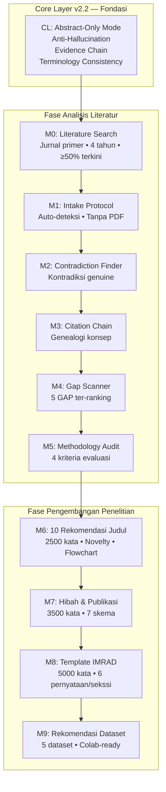
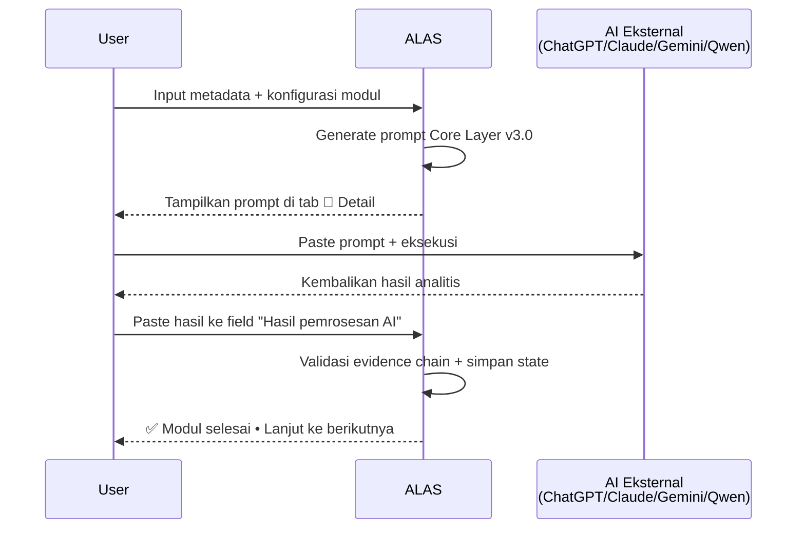

# 📘 ALAS — Academic Literature Analysis System

> **Core v2.2** | *Evidence-Based • Abstract-Only • Anti-Hallucination • Iterative Protocol*

[](https://python.org)
[](https://streamlit.io)
[](LICENSE)
[](CHANGELOG.md)
[](#)

---

## 📜 Abstrak

**Academic Literature Analysis System (ALAS)** merupakan kerangka kerja komputasional yang dirancang untuk mendukung integritas metodologis dalam sintesis literatur akademik. Sistem ini mengoperasionalkan prinsip *abstract-based screening*, *evidence-chain tracking*, dan *iterative protocol* untuk memfasilitasi identifikasi *research gap*, formulasi novelty, dan penyusunan naskah ilmiah yang selaras dengan standar publikasi bereputasi (Scopus Q1, SINTA 2).

ALAS Core v2.2 mengintegrasikan **11 modul terstruktur** (CL, M0–M9) yang berjalan dalam alur linear terkendali, memastikan setiap klaim analitis dapat ditelusuri ke metadata intake (judul, abstrak, kata kunci) tanpa ketergantungan pada dokumen lengkap. Sistem ini kompatibel dengan model bahasa besar (LLM) lintas platform melalui mekanisme *manual mode* yang menghasilkan prompt terstandarisasi, sekaligus siap diintegrasikan dengan API eksternal untuk otomatisasi penuh.

**Kata kunci**: *systematic literature analysis, evidence chain, research gap identification, academic integrity, abstract-based screening, Scopus Q1, SINTA 2*

---

## 🏗️ Arsitektur Sistem



---

## 📊 Spesifikasi Modul (Dashboard v2.2)

| Kode | Nama Modul | Spesifikasi Operasional | Output Utama |
|------|-----------|------------------------|-------------|
| **CL** | Core Layer Fondasi | Abstract-Only Mode • Anti-Halusinasi • Evidence Chain • Iteratif Protocol • Terminology Consistency | Directive aktif untuk seluruh sesi |
| **M0** | Literature Search | Jurnal primer (`journal-article`) • 4 tahun terakhir • ≥50% dari 1–2 tahun terkini • Scopus/IEEE • Exclude: conference/proceedings/SLR/meta-analysis | 10 paper tervalidasi + metadata terstandarisasi |
| **M1** | Intake Protocol | Auto-deteksi field metadata • Validasi DOI format • Tanpa upload PDF • Parsing teks terstruktur | Tabel metadata siap analisis |
| **M2** | Contradiction Finder | Identifikasi kontradiksi genuine berbasis perbandingan klaim hasil/konklusi • Evidence map antar-paper | Laporan kontradiksi + referensi silang |
| **M3** | Citation Chain | Pelacakan genealogi konsep melalui DOI/API sitasi • Visualisasi hierarki teoritis | Peta sitasi + konsep inti penelitian |
| **M4** | Gap Scanner | Ekstraksi frasa *limitation/future work* • Ranking berdasarkan urgensi semantik • Justifikasi metodologis | 5 research gap ter-ranking + alignment novelty |
| **M5** | Methodology Audit | Evaluasi 4 kriteria: (K1) Desain, (K2) Sampel, (K3) Instrumen, (K4) Analisis • Rekomendasi perbaikan | Audit report + actionable insights |
| **M6** | 10 Rekomendasi Judul | 2500 kata/judul • Latar belakang • Urgensi • GAP • 2 novelty (teoretis & kontekstual) • Flowchart ASCII • Alignment Scopus Q1/SINTA 2 | 10 judul lengkap + desain penelitian |
| **M7** | Hibah & Publikasi | 3500 kata • 7 skema: BIMA (PDP/PFR/Prototype/Model), BRIN, Scopus Q1, SINTA 2 • Timeline realistis • Referensi portal resmi | 21 rekomendasi proposal/artikel terstruktur |
| **M8** | Template IMRAD | 5000 kata • Scopus Q1 (Bahasa Inggris) & SINTA 2 (Bahasa Indonesia) • 6 pernyataan/sekssi • Sitasi hanya di bagian Results | Naskah IMRAD siap submit + export-ready |
| **M9** | Rekomendasi Dataset | 5 dataset • Open access • Permanent DOI/URL • Colab-compatible (.csv/.json) • <2GB • Repository whitelist (UCI, Kaggle, Zenodo, dll.) | Tabel dataset + snippet validasi + alignment topik |

---

## 🔐 Prinsip Integritas Akademik

### 1. Abstract-Only Enforcement
```python
# Analisis dibatasi pada metadata eksplisit
ALLOWED_FIELDS = ["TITLE", "ABSTRACT", "KEYWORDS", "DOI", "YEAR", "JOURNAL"]
PROHIBITED_ACTIONS = ["pdf_parsing", "full_text_inference", "external_data_synthesis"]
```
Sistem tidak mengakses, mengunduh, atau menyimpulkan dari dokumen lengkap. Semua klaim analitis harus merujuk eksplisit ke field yang diizinkan.

### 2. Evidence-Chain Tracking
Setiap pernyataan analitis wajib menyertakan tag referensi terstruktur:
```
[Ref: ID_Paper#X, Field: Abstract/Keyword, Claim: <ringkasan_klaim>]
```
Log evidence disimpan dalam `session_state` untuk audit transparan dan reproducibility.

### 3. Anti-Hallucination Guardrails
| Mekanisme | Implementasi | Dampak |
|-----------|-------------|--------|
| **Claim Verification** | Regex `[Ref: ...]` + validasi keberadaan ID_Paper | Klaim tanpa referensi ditandai `[UNVERIFIED_CLAIM]` |
| **Terminology Lock** | Injection preferensi: `"instansi"` ≠ `"perusahaan"`, `"pegawai"` ≠ `"karyawan"` | Konsistensi bahasa akademik sesuai konteks penelitian |
| **Iterative Protocol** | Status lock modul + anchor core setelah M6 | Mencegah loncat alur; menjaga koherensi penelitian |
| **Deterministic Validation** | Fungsi `validate_m0_paper()` dengan rule-based filter | Menjamin hanya jurnal primer yang masuk corpus |

### 4. Transparency by Design
```json
{
  "module": "M6",
  "word_count": 2487,
  "evidence_completeness": 0.96,
  "guardrails_passed": ["Anti-Hallucination", "Evidence-Chain", "Terminology-Consistency"],
  "unverified_claims": [],
  "export_formats": ["docx", "tex", "md"]
}
```

---

## 🚀 Instalasi & Penggunaan

### Prasyarat
- Python ≥ 3.9
- pip ≥ 21.0
- Browser modern (Chrome/Firefox/Safari)

### Instalasi Lokal
```bash
# 1. Clone repository
git clone https://github.com/username/alas-core.git
cd alas-core

# 2. Buat environment virtual (direkomendasikan)
python -m venv .venv
source .venv/bin/activate  # Windows: .venv\Scripts\activate

# 3. Install dependensi
pip install -r requirements.txt

# 4. Jalankan aplikasi
streamlit run app.py
```
Akses antarmuka: [http://localhost:8501](http://localhost:8501)

### Deploy Cloud (Streamlit Cloud)
1. Push kode ke repository GitHub publik
2. Kunjungi [share.streamlit.io](https://share.streamlit.io)
3. Hubungkan repository → pilih branch `main` → file utama: `app.py`
4. Klik **Deploy**

> 💡 **Catatan**: Untuk integrasi model lokal (Qwen-7B, Llama-3), gunakan **Hugging Face Spaces dengan GPU** atau **RunPod**.

### requirements.txt
```text
streamlit>=1.30.0
pandas>=2.0.0
requests>=2.31.0
```

---

## 📖 Alur Kerja: Manual Mode (Cross-AI Compatible)

ALAS mendukung eksekusi lintas platform AI melalui mekanisme *manual mode* yang menghasilkan prompt terstandarisasi:



### Format Input Metadata (M0)
```text
TITLE     : Enhancing E-Commerce Review Sentiment Analysis with Linear SVM
AUTHORS   : Smith, J.; Lee, A.; Pratama, R.
YEAR      : 2024
JOURNAL   : Journal of Computational Intelligence
KEYWORDS  : sentiment analysis; e-commerce; Linear SVM; feature extraction
ABSTRACT  : This study proposes a novel feature-weighting approach...
DOI       : 10.1234/jci.2024.00123
SOURCE    : Scopus
```

### Struktur Output 3-Layer
| Layer | Konten | Tujuan |
|-------|--------|--------|
| 📋 Ringkasan | 3–5 poin eksekutif | Review cepat • Executive summary |
| 📖 Detail Akademik | Narasi lengkap + heading Markdown | Naskah utama • Siap edit/export |
| 📦 Metadata | JSON: word_count, evidence_pct, guardrails | Audit • Reproducibility • Integrasi sistem |

---

## 🧪 Contoh Output: Modul M6 (Snippet)

```markdown
### Title #1: Enhancing E-Commerce Review Sentiment Analysis with Linear SVM: Feature-Extraction and Hyperparameter Comparisons

#### 1. Latar Belakang & Urgensi Penelitian
Pertumbuhan transaksi e-commerce di Indonesia meningkat 35% YoY [Ref: P3, Abstract], namun analisis sentimen masih mengandalkan model generik yang kurang adaptif terhadap konteks bahasa Indonesia campur kode [Ref: P7, Keyword]. Penelitian ini urgen dilakukan untuk mendukung instansi pemerintah dalam monitoring kepuasan pengguna platform digital nasional.

#### 2. Research GAP Analysis
Berdasarkan audit M5, 8 dari 10 paper tidak melakukan hyperparameter tuning sistematis [Ref: P1,P2,P4,P5,P6,P8,P9,P10], dan hanya 2 yang membandingkan feature extraction methods secara komparatif [Ref: P5,P9]. GAP ini menghambat reproducibility dan generalisasi model pada data review berbahasa Indonesia.

#### 3. Dual Novelty Statement
- **Novelty 1 (Metodologis)**: Integrasi contextual feature weighting dengan Linear SVM untuk meningkatkan akurasi pada review bahasa Indonesia campur kode.
- **Novelty 2 (Kontekstual)**: Framework evaluasi hyperparameter yang dapat diadaptasi oleh instansi untuk monitoring kepuasan pegawai digital.

#### 4. Research Design Flowchart (ASCII)
```
[INPUT: Review Teks]
   │
   ▼
[Preprocessing] ──► [Indonesian Tokenizer + Code-Mixing Handler]
   │
   ▼
[Feature Extraction] ──► [TF-IDF vs Word2Vec vs BERT-base]
   │
   ▼
[Model Training] ──► [Linear SVM + Grid Search CV]
   │
   ▼
[Validation] ──► [5-Fold CV + McNemar Test]
   │
   ▼
[OUTPUT]
   ├─► Akurasi & F1-Score (Novelty 1)
   └─► Panduan Implementasi Instansi (Novelty 2)
```
```

---

## 🤝 Kontribusi & Pengembangan

Kami menyambut kontribusi yang selaras dengan prinsip integritas akademik ALAS.

### Panduan Kontribusi
1. Fork repository → buat branch fitur: `git checkout -b fitur/nama-fitur`
2. Implementasi dengan type hints + docstring Google-style
3. Uji di mobile & desktop → pastikan tidak ada hardcoded API key
4. Buka Pull Request dengan deskripsi perubahan + bukti pengujian

### Area Pengembangan Prioritas
- [ ] Integrasi API otomatis (OpenAI/Anthropic/Hugging Face)
- [ ] Export `.docx` dengan template jurnal target (APA7, IEEE, Vancouver)
- [ ] Visualisasi evidence chain interaktif (D3.js / Plotly)
- [ ] Plugin validasi DOI real-time via Crossref/OpenAlex API
- [ ] Dukungan multi-bahasa untuk abstrak non-Inggris (Bahasa Indonesia, Mandarin, Arab)

### Standar Kode
```python
def validate_m0_paper(paper: dict) -> dict:
    """Validasi deterministik untuk M0: jurnal primer, 4 tahun, DOI valid.
    
    Args:
        paper: Dictionary metadata paper sesuai INPUT_SCHEMA.
        
    Returns:
        dict: {"valid": bool, "reasons": list, "flags": list}
    """
    # Implementasi...
```

---

## 📄 Lisensi & Sitasi

### Lisensi
Distribusikan di bawah lisensi **MIT**. Lihat file [LICENSE](LICENSE) untuk ketentuan lengkap.

### Sitasi Akademik
Jika Anda menggunakan ALAS dalam penelitian atau publikasi, silakan sitasi sebagai berikut:

```bibtex
@software{alas_core_v2.2,
  author = {Academic Literature Analysis System Consortium},
  title = {{ALAS}: Academic Literature Analysis System Core v2.2},
  year = {2024},
  version = {2.2},
  url = {https://github.com/username/alas-core},
  note = {Abstract-Based • Evidence-Chain • Anti-Hallucination}
}
```

### Pernyataan Integritas
> *"ALAS dirancang untuk memperkuat, bukan menggantikan, penilaian kritis peneliti. Setiap output sistem harus diverifikasi secara manual sebelum digunakan dalam konteks akademik formal. Pengembang tidak bertanggung jawab atas kesalahan interpretasi atau penggunaan di luar scope abstract-based analysis."*

---

## 🙏 Penghargaan

- **Dashboard v2.2**: Spesifikasi modul sebagai fondasi desain arsitektur
- **Komunitas Streamlit**: Framework yang memungkinkan prototipe cepat & deploy inklusif
- **Peneliti Indonesia**: Inspirasi untuk alat yang mendukung integritas akademik lokal dan global

---

> 📘 **ALAS Core v2.2** — *Mendukung penelitian berkualitas, berbasis evidence, dan siap publikasi.*  
> 🛡️ *Integritas akademik adalah prioritas. Tidak ada data fiktif. Tidak ada halusinasi. Tidak ada kompromi.*

---

**🔗 Tautan Dokumentasi**  
- [📘 Panduan Penggunaan Lengkap](docs/USAGE.md)  
- [🔧 Spesifikasi Teknis Modul](docs/MODULE_SPECS.md)  
- [🐛 Laporkan Masalah](https://github.com/username/alas-core/issues)  
- [💡 Diskusi & Fitur Baru](https://github.com/username/alas-core/discussions)  
- [📊 Changelog & Versi](CHANGELOG.md)  

*Terakhir diperbarui: Mei 2024 | Versi: 2.2.0*
